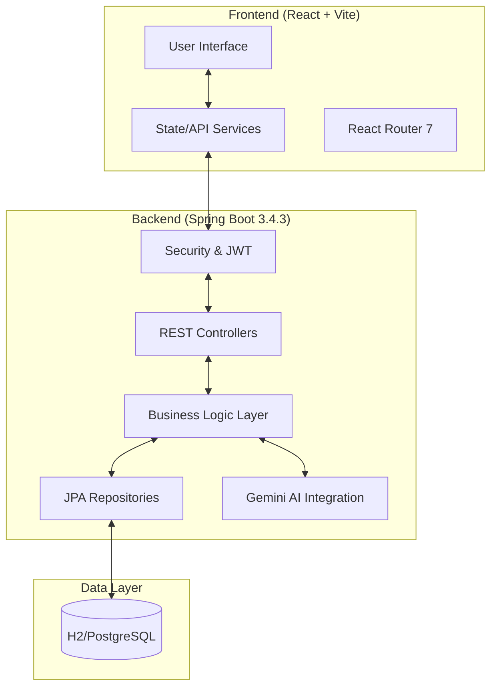
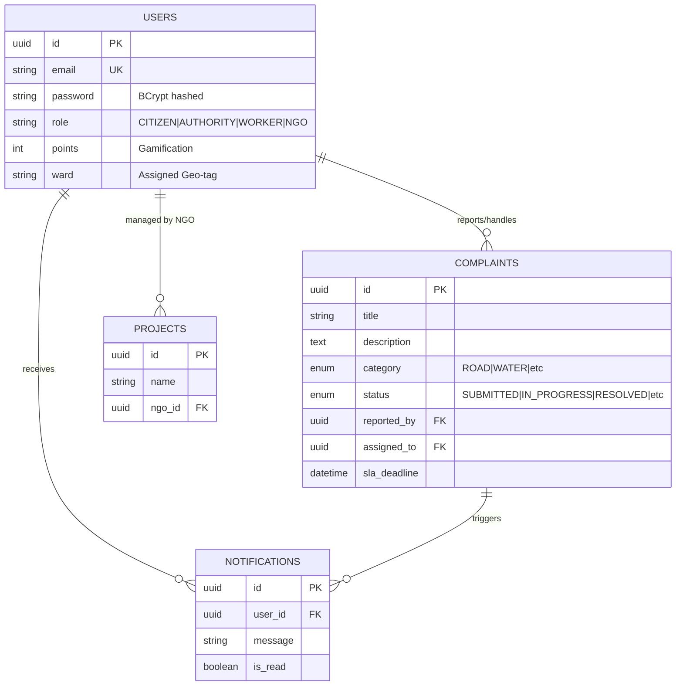

# CivicPulse — Full Project Documentation

CivicPulse is a modern, AI-powered civic management platform designed to bridge the gap between citizens, government authorities, field workers, and NGOs. It streamlines the process of reporting, tracking, and resolving urban issues (like road damage, water supply, or electrical faults) through a transparent, high-performance web interface.

---

## 1. System Architecture

CivicPulse follows a **Client-Server Architecture** with a clear separation between the presentation layer and the business logic layer.

### Key Architectural Patterns:
- **Layered Architecture:** Backend is structured into Controller, Service, and Repository layers for maintainability.
- **Role-Based Access Control (RBAC):** Distinct dashboards and permissions for Citizens, Authorities, Workers, and NGOs.
- **AI-First Design:** Integration of Google Gemini 2.5-flash for complaint classification, routing, and a multilingual support chatbot.
- **Mobile-Responsive:** The UI is designed to work seamlessly on both mobile devices (for field workers) and desktops (for authorities).

---

## 2. Technology Stack

### 2.1 Backend
- **Framework:** Spring Boot 3.4.3 (Java 17)
- **Security:** Spring Security with stateless JWT (JSON Web Token) authentication.
- **Database Access:** Spring Data JPA with Hibernate.
- **Communication:** RESTful APIs (Spring Web).
- **Utilities:** Lombok (code generation), Jakarta Validation (input sanitization), Spring Mail.
- **AI Integration:** Google Gemini API (via HTTP/REST).

### 2.2 Frontend
- **Framework:** React 18.3 (Vite 6.3)
- **Styling:** TailwindCSS 4.0 for modern, utility-first UI design.
- **UI Components:** 
    - Radix UI & Shadcn/UI (accessible primitives)
    - Lucide React (icons)
    - Recharts (analytics dashboards)
- **Routing:** React Router 7.
- **State Management:** LocalStorage for persistent auth sessions, React Hooks for component state.

### 2.3 Database
- **Development:** H2 File-based persistent SQL database (for zero-config setup).
- **Production:** PostgreSQL (ready-to-go driver configuration).

---

## 3. Database Schema (ER Model)

CivicPulse uses a relational model to manage complex entity relationships.

---

## 4. Application Flow & Lifecycle

### 4.1 The Complaint Lifecycle
The core workflow of CivicPulse revolves around the resolution of urban issues.

1.  **Submission:** A Citizen reports an issue with images and location coordinates.
2.  **AI Routing:** Gemini AI analyzes the title/description to:
    -   Classify the category (e.g., "Roads").
    -   Assign priority (e.g., "Critical" for safety hazards).
    -   Direct it to the appropriate Government Ward/Department.
3.  **Acknowledgement:** Government Authorities review the queue and "Acknowledge" the issue.
4.  **Assignment:** Authorities assign the task to a specific Field Worker based on their current workload and department.
5.  **Resolution:** 
    -   The Worker updates the status to "In Progress".
    -   The Worker completes the task and uploads "Proof of Work" (Before/After images).
6.  **Gamification:** The Citizen receives "Civic Points" once the issue is resolved, which can be tracked on the leaderboard.

### 4.2 AI Integration (Gemini 2.5-flash)
CivicPulse stands out by using a "Brain" layer:
-   **Auto-Routing:** Predicts which government department should handle a specific complaint text.
-   **Urgency Detection:** Automatically moves complaints to the top of the queue if they contain emergency keywords (e.g., "Wire sparking", "Flood").
-   **Multilingual Support:** The built-in AI Chatbot supports all Indian regional languages, allowing citizens to communicate in their native dialect.

---

## 5. Portal Overviews

### 5.1 Citizen Portal (`/citizen`)
- **Dashboard:** Activity feed of personal and nearby issues.
- **Reporting:** Geolocation-aware form for quick submission.
- **Rewards:** Gamified leaderboard showing contribution impact.
- **AI Assistant:** Multilingual chatbot for navigation and help.

### 5.2 Authority Portal (`/authority`)
- **Analytics:** High-level charts (Recharts) showing resolution rates, SLA breaches, and category trends.
- **Management:** Centralized table for acknowledging, rejecting, or assigning complaints.
- **Worker Tracking:** Management of field staff availability and performance.

### 5.3 Worker Portal (`/worker`)
- **Task List:** Clean, list-view of assigned jobs.
- **Field Action:** Direct navigation links to complaint sites and proof-of-work upload.
- **Performance:** Tracking of personal SLA compliance.

### 5.4 NGO Portal (`/ngo`)
- **Sponsorship:** Ability to "Sponsor" specific high-priority issues.
- **Impact Tracking:** Viewing historical data of community improvements.

---

## 6. API Reference (Core Endpoints)

| Endpoint | Method | Role | Description |
|---|---|---|---|
| `/api/auth/login` | POST | Public | Returns JWT token and user profile. |
| `/api/complaints` | POST | Citizen | Submit a new issue report. |
| `/api/complaints/assign` | PATCH | Authority | Assign a worker to a specific issue. |
| `/api/complaints/resolve` | PATCH | Worker | Complete work with images. |
| `/api/analytics/dashboard`| GET | Authority | Fetch aggregate stats for charts. |
| `/api/ai/chat` | POST | User | Communication with Gemini AI Assistant. |

---

## 7. Configuration & Deployment

### Backend Setup:
1.  Configure `application.properties` with Gemini API Key.
2.  Run `./mvnw spring-boot:run`.
3.  Access H2 console at `/h2-console` for database inspection.

### Frontend Setup:
1.  Install dependencies: `npm install`.
2.  Start dev server: `npm run dev`.
3.  Vite proxy handles API calls to `localhost:8080`.

---
*Documentation generated on April 7, 2026 for the CivicPulse Dev Team.*
