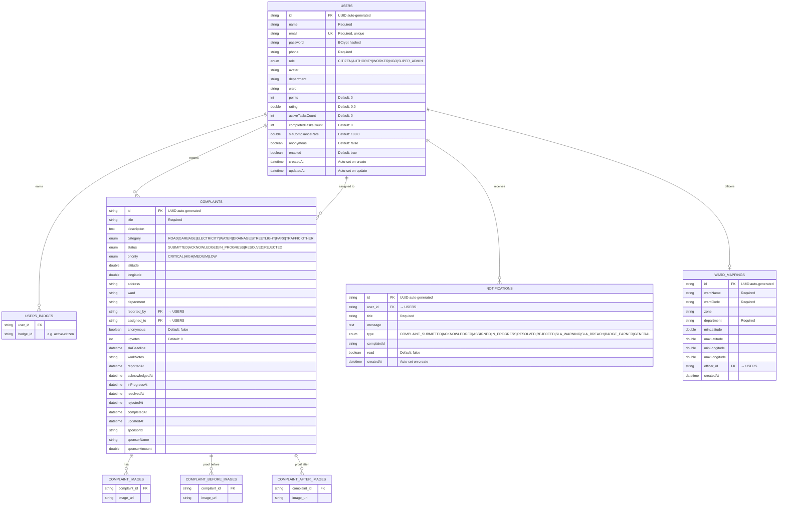

# CivicPulse Backend — Complete Technical Documentation

> **Version:** 0.0.1-SNAPSHOT  
> **Framework:** Spring Boot 3.4.3 (Java 17)  
> **Last Updated:** March 18, 2026

---

## Table of Contents

1. [Architecture Overview](#1-architecture-overview)
2. [Technology Stack](#2-technology-stack)
3. [Project Structure](#3-project-structure)
4. [Database Design](#4-database-design)
5. [Authentication & Security](#5-authentication--security)
6. [API Reference](#6-api-reference)
7. [Service Layer (Business Logic)](#7-service-layer-business-logic)
8. [Smart Routing & SLA Engine](#8-smart-routing--sla-engine)
9. [Notification System](#9-notification-system)
10. [Data Seeder (Initial Data)](#10-data-seeder-initial-data)
11. [Configuration](#11-configuration)
12. [Running the Application](#12-running-the-application)
13. [Test Accounts](#13-test-accounts)

---

## 1. Architecture Overview

CivicPulse follows a **layered architecture** built on Spring Boot:

```
┌─────────────────────────────────────────────────────────────┐
│                    React Frontend (Vite)                     │
│                   http://localhost:5173                      │
└──────────────────────────┬──────────────────────────────────┘
                           │  API calls via Vite proxy → /api/*
                           ▼
┌─────────────────────────────────────────────────────────────┐
│                 Spring Boot Backend                         │
│                 http://localhost:8080                        │
│                                                             │
│  ┌──────────────┐  ┌──────────────┐  ┌──────────────────┐  │
│  │  Controllers │──▶   Services   │──▶   Repositories   │  │
│  │(REST API)    │  │(Business     │  │(JPA / H2 DB)     │  │
│  └──────────────┘  │ Logic)       │  └──────────────────┘  │
│         ▲          └──────────────┘           │             │
│         │                                     ▼             │
│  ┌──────────────┐                  ┌──────────────────┐    │
│  │ JWT Security │                  │  H2 File-based   │    │
│  │   Filter     │                  │   Database       │    │
│  └──────────────┘                  │  ./data/civicpulse│    │
│                                    └──────────────────┘    │
└─────────────────────────────────────────────────────────────┘
```

**Request flow:**
1. Frontend sends HTTP request to `/api/*`
2. Vite dev proxy forwards it to `localhost:8080`
3. `JwtAuthenticationFilter` extracts & validates the JWT token
4. Spring Security enforces role-based access
5. Controller delegates to Service layer
6. Service executes business logic + interacts with Repository
7. Repository performs JPA/Hibernate queries on H2 database
8. Response is serialized to JSON and returned

---

## 2. Technology Stack

| Technology | Version | Purpose |
|---|---|---|
| **Java** | 17 | Core language |
| **Spring Boot** | 3.4.3 | Application framework |
| **Spring Security** | 6.x | Authentication & authorization |
| **Spring Data JPA** | 3.x | Database ORM layer |
| **Hibernate** | 6.x | JPA implementation |
| **H2 Database** | Latest | File-based persistent database (dev) |
| **PostgreSQL** | Latest | Production-ready database (included) |
| **JJWT** | 0.12.6 | JSON Web Token generation & validation |
| **Lombok** | Latest | Boilerplate code reduction |
| **Jakarta Validation** | 3.x | DTO input validation |
| **Maven** | 3.x | Build & dependency management |
| **Spring Boot Mail** | 3.x | Email notification support |

### Maven Dependencies (pom.xml)

```xml
spring-boot-starter-data-jpa     → JPA + Hibernate + HikariCP
spring-boot-starter-security     → Spring Security framework
spring-boot-starter-validation   → Bean validation (Jakarta)
spring-boot-starter-web          → REST API + embedded Tomcat
spring-boot-starter-mail         → SMTP mail sending
h2                               → Embedded SQL database (runtime)
postgresql                       → PostgreSQL driver (runtime)
jjwt-api + jjwt-impl + jjwt-jackson → JWT library
lombok                           → @Data, @Builder, @RequiredArgsConstructor
```

---

## 3. Project Structure

```
civicpulse-backend/
├── pom.xml                                    # Maven project config
├── mvnw / mvnw.cmd                            # Maven wrapper scripts
├── data/
│   └── civicpulse.mv.db                       # H2 persistent database file
├── src/main/
│   ├── resources/
│   │   └── application.properties             # App configuration
│   └── java/com/civicpulse/backend/
│       ├── BackendApplication.java            # Spring Boot entry point
│       ├── config/
│       │   ├── SecurityConfig.java            # Security filter chain + CORS
│       │   └── DataSeeder.java                # Initial data population
│       ├── controller/
│       │   ├── AuthController.java            # Login / Register endpoints
│       │   ├── ComplaintController.java        # CRUD + lifecycle endpoints
│       │   ├── AnalyticsController.java        # Dashboard statistics
│       │   ├── NotificationController.java     # User notifications
│       │   ├── UserController.java             # User profiles & workers
│       │   └── GlobalExceptionHandler.java     # Centralized error handling
│       ├── dto/
│       │   ├── LoginRequest.java              # Login input DTO
│       │   ├── RegisterRequest.java           # Registration input DTO
│       │   ├── ComplaintRequest.java           # Complaint submission DTO
│       │   ├── ComplaintResponse.java          # Complaint output DTO
│       │   ├── AuthResponse.java              # Auth success response DTO
│       │   └── DashboardStats.java            # Analytics response DTO
│       ├── entity/
│       │   ├── User.java                      # User entity (all roles)
│       │   ├── Complaint.java                 # Complaint/Issue entity
│       │   ├── Notification.java              # Notification entity
│       │   └── WardMapping.java               # Geographic ward entity
│       ├── repository/
│       │   ├── UserRepository.java            # User data access
│       │   ├── ComplaintRepository.java        # Complaint data access
│       │   ├── NotificationRepository.java     # Notification data access
│       │   └── WardMappingRepository.java      # Ward mapping data access
│       ├── service/
│       │   ├── AuthService.java               # Registration + Login logic
│       │   ├── ComplaintService.java           # Full complaint lifecycle
│       │   ├── AnalyticsService.java           # Dashboard stat computation
│       │   ├── NotificationService.java        # Notification creation/management
│       │   ├── RoutingService.java             # Smart ward/department routing
│       │   └── SlaService.java                # SLA deadline calculation
│       └── security/
│           ├── JwtTokenProvider.java           # JWT token operations
│           └── JwtAuthenticationFilter.java    # HTTP filter for JWT auth
```

---

## 4. Database Design

### 4.1 Entity-Relationship Diagram



### 4.2 Database Configuration

| Property | Value |
|---|---|
| **Engine** | H2 (file-based, persistent) |
| **JDBC URL** | `jdbc:h2:file:./data/civicpulse` |
| **Username** | `sa` |
| **Password** | `civicpulse2026` |
| **DDL Strategy** | `update` (auto-creates/alters tables) |
| **H2 Console** | Enabled at `/h2-console` |
| **Connection Pool** | HikariCP (max 10, min idle 2) |

### 4.3 Database File Location

```
civicpulse-backend/data/civicpulse.mv.db
```

Data persists across application restarts because of `DB_CLOSE_ON_EXIT=FALSE`.

---

## 5. Authentication & Security

### 5.1 JWT-Based Authentication Flow

```
┌──────────┐                    ┌──────────────┐                    ┌─────────┐
│  Client  │                    │ AuthController│                    │  H2 DB  │
└────┬─────┘                    └──────┬───────┘                    └────┬────┘
     │  POST /api/auth/login           │                                 │
     │  { email, password }            │                                 │
     │────────────────────────────────▶│                                 │
     │                                 │  findByEmail()                  │
     │                                 │────────────────────────────────▶│
     │                                 │◀────────────────────────────────│
     │                                 │  BCrypt.matches(password)       │
     │                                 │                                 │
     │                                 │  JwtTokenProvider.generateToken │
     │                                 │  (userId, role)                 │
     │                                 │                                 │
     │  { token, id, name, email,      │                                 │
     │    role, points, badges }       │                                 │
     │◀────────────────────────────────│                                 │
     │                                 │                                 │
     │  GET /api/complaints            │                                 │
     │  Authorization: Bearer <token>  │                                 │
     │────────────────────────────────▶│                                 │
     │        JwtAuthenticationFilter  │                                 │
     │        validates token,         │                                 │
     │        sets SecurityContext     │                                 │
     │                                 │                                 │
```

### 5.2 JWT Token Structure

```json
{
  "sub": "user-uuid-here",          // User ID (UUID)
  "role": "CITIZEN",                // User role
  "iat": 1710754800,                // Issued at timestamp
  "exp": 1710841200                 // Expires in 24 hours
}
```

**Signing:** HMAC-SHA512 with a 256-bit secret key  
**Expiration:** 86,400,000 ms (24 hours)

### 5.3 Security Configuration

```java
// SecurityConfig.java — Filter Chain Rules
.authorizeHttpRequests(auth -> auth
    .requestMatchers("/api/auth/**").permitAll()           // ✅ Public
    .requestMatchers("/h2-console/**").permitAll()          // ✅ Public (dev)
    .requestMatchers(GET, "/api/complaints/**").permitAll() // ✅ Public reads
    .requestMatchers(GET, "/api/analytics/**").permitAll()  // ✅ Public reads
    .anyRequest().authenticated()                           // 🔒 Everything else
)
```

### 5.4 Role-Based Access Control

| Endpoint | Required Role |
|---|---|
| `POST /api/complaints` | Any authenticated user |
| `GET /api/complaints/my` | Any authenticated user |
| `GET /api/complaints/worker/tasks` | `WORKER` |
| `PATCH /api/complaints/{id}/acknowledge` | `AUTHORITY` or `SUPER_ADMIN` |
| `PATCH /api/complaints/{id}/assign` | `AUTHORITY` or `SUPER_ADMIN` |
| `PATCH /api/complaints/{id}/start` | `WORKER` |
| `PATCH /api/complaints/{id}/resolve` | `WORKER` |
| `PATCH /api/complaints/{id}/reject` | `AUTHORITY` or `SUPER_ADMIN` |
| `GET /api/users/workers` | `AUTHORITY` or `SUPER_ADMIN` |
| `GET /api/analytics/worker` | `WORKER` |

### 5.5 Password Security

Passwords are hashed using **BCrypt** (via `BCryptPasswordEncoder`). Raw passwords are never stored. The encoder automatically handles salting.

---

## 6. API Reference

### 6.1 Authentication Endpoints

#### `POST /api/auth/register`

Register a new user account.

**Request Body:**
```json
{
  "name": "John Doe",           // Required
  "email": "john@example.com",  // Required, unique, valid email
  "password": "secure123",      // Required, min 6 chars
  "phone": "9876543210",        // Required
  "role": "CITIZEN",            // Optional (defaults to CITIZEN)
  "department": "Public Works", // Optional (for WORKER/AUTHORITY)
  "ward": "WARD-001"            // Optional
}
```

**Response (200 OK):**
```json
{
  "token": "eyJhbGciOiJIUz...",
  "id": "a1b2c3d4-...",
  "name": "John Doe",
  "email": "john@example.com",
  "role": "CITIZEN",
  "department": null,
  "points": 0,
  "badges": []
}
```

#### `POST /api/auth/login`

Authenticate an existing user.

**Request Body:**
```json
{
  "email": "john@example.com",  // Required, valid email
  "password": "secure123"       // Required
}
```

**Response (200 OK):** Same structure as register response.

**Error (400):**
```json
{
  "error": "Invalid email or password",
  "message": "Invalid email or password"
}
```

---

### 6.2 Complaint Endpoints

#### `POST /api/complaints` 🔒

Submit a new complaint (citizen flow).

**Headers:** `Authorization: Bearer <token>`

**Request Body:**
```json
{
  "title": "Broken Road on MG Road",        // Required
  "description": "Large pothole causing...", // Optional
  "category": "ROAD",                        // Required (see IssueCategory enum)
  "latitude": 19.0760,                       // GPS coordinates
  "longitude": 72.8777,
  "address": "MG Road, Near City Mall",
  "images": ["https://..."],                 // Optional image URLs
  "anonymous": false                         // Optional
}
```

**Response (200 OK):** `ComplaintResponse` object (see below).

**Side Effects:**
- Auto-detects ward from GPS coordinates
- Auto-routes to correct department based on category
- AI-based priority detection from keywords
- Calculates SLA deadline
- Awards citizen +10 points
- Sends notification to citizen

#### `GET /api/complaints` ✅ Public

Get all open complaints, ordered by priority.

**Query Parameters (all optional):**
| Param | Description | Example |
|---|---|---|
| `status` | Filter by status | `SUBMITTED`, `IN_PROGRESS` |
| `category` | Filter by category | `ROAD`, `WATER` |
| `department` | Filter by department | `Public Works` |
| `ward` | Filter by ward code | `WARD-001` |

**Response (200 OK):** `ComplaintResponse[]`

#### `GET /api/complaints/{id}` ✅ Public

Get a single complaint by ID.

#### `GET /api/complaints/my` 🔒

Get complaints submitted by the current user.

#### `GET /api/complaints/worker/tasks` 🔒 WORKER

Get tasks assigned to the current worker.

#### `PATCH /api/complaints/{id}/acknowledge` 🔒 AUTHORITY

Mark a complaint as acknowledged by the authority.

**Side Effects:**
- Status changes to `ACKNOWLEDGED`
- Sets `acknowledgedAt` timestamp
- Sends notification to citizen

#### `PATCH /api/complaints/{id}/assign` 🔒 AUTHORITY

Assign a complaint to a worker.

**Request Body:**
```json
{
  "workerId": "worker-uuid-here"
}
```

**Side Effects:**
- Status changes to `ACKNOWLEDGED`
- Worker's `activeTasksCount` incremented
- Notification sent to both citizen and worker

#### `PATCH /api/complaints/{id}/start` 🔒 WORKER

Worker starts working on a complaint.

**Side Effects:**
- Status changes to `IN_PROGRESS`
- Sets `inProgressAt` timestamp
- Notification sent to citizen

#### `PATCH /api/complaints/{id}/resolve` 🔒 WORKER

Worker resolves a complaint with proof of work.

**Request Body:**
```json
{
  "beforeImages": ["https://..."],
  "afterImages": ["https://..."],
  "workNotes": "Fixed the pothole with asphalt patch"
}
```

**Side Effects:**
- Status changes to `RESOLVED`
- Sets `resolvedAt` and `completedAt` timestamps
- Worker's `activeTasksCount` decremented, `completedTasksCount` incremented
- SLA compliance rate recalculated for worker
- Citizen awarded +25 points
- Notification sent to citizen

#### `PATCH /api/complaints/{id}/reject` 🔒 AUTHORITY

Reject a complaint.

**Request Body:**
```json
{
  "reason": "Duplicate complaint - already tracked under ID xyz"
}
```

#### `POST /api/complaints/{id}/upvote` ✅ Public

Upvote a complaint.

**Side Effects:**
- `upvotes` incremented
- **Auto-escalation:** 50+ upvotes on MEDIUM → upgrades to HIGH
- **Auto-escalation:** 100+ upvotes on HIGH → upgrades to CRITICAL

---

### 6.3 ComplaintResponse DTO

Every complaint endpoint returns this structure:

```json
{
  "id": "uuid-string",
  "title": "Broken Road on MG Road",
  "description": "Large pothole causing accidents",
  "category": "road",           // lowercase
  "status": "in-progress",      // lowercase, hyphenated
  "priority": "high",           // lowercase
  "latitude": 19.0760,
  "longitude": 72.8777,
  "address": "MG Road, Near City Mall",
  "ward": "WARD-001",
  "department": "Public Works",
  "reportedById": "citizen-uuid",
  "reportedByName": "Rajesh Kumar",  // "Anonymous" if anonymous
  "assignedToId": "worker-uuid",     // null if unassigned
  "assignedToName": "Suresh Singh",  // null if unassigned
  "anonymous": false,
  "upvotes": 42,
  "images": ["https://..."],
  "slaDeadline": "2026-03-19T07:00:00",
  "reportedAt": "2026-03-18T12:00:00",
  "acknowledgedAt": "2026-03-18T13:00:00",
  "inProgressAt": "2026-03-18T14:00:00",
  "resolvedAt": null,
  "updatedAt": "2026-03-18T14:00:00",
  "beforeImages": [],
  "afterImages": [],
  "workNotes": null,
  "sponsorName": null,
  "sponsorAmount": null
}
```

---

### 6.4 Analytics Endpoints

#### `GET /api/analytics/dashboard` ✅ Public

Returns aggregate statistics for the authority dashboard.

**Response (200 OK):**
```json
{
  "totalComplaints": 120,
  "resolved": 45,
  "inProgress": 30,
  "pending": 40,              // submitted + acknowledged
  "critical": 5,
  "slaBreaches": 3,
  "resolutionRate": 37.5,     // percentage
  "byCategory": {
    "ROAD": 25,
    "WATER": 18,
    "ELECTRICITY": 15,
    "GARBAGE": 12
  },
  "byStatus": {
    "SUBMITTED": 20,
    "ACKNOWLEDGED": 20,
    "IN_PROGRESS": 30,
    "RESOLVED": 45,
    "REJECTED": 5
  },
  "weeklyTrend": [
    { "date": "2026-03-12", "count": 8 },
    { "date": "2026-03-13", "count": 12 }
  ],
  "topWorkers": [
    {
      "id": "worker-uuid",
      "name": "Ramesh Yadav",
      "department": "Electricity",
      "completedTasks": 203,
      "slaCompliance": 97.2,
      "rating": 4.9,
      "avatar": "https://..."
    }
  ]
}
```

#### `GET /api/analytics/worker` 🔒 WORKER

Returns personalized stats for the logged-in worker.

**Response:**
```json
{
  "activeTasks": 3,
  "completedToday": 2,
  "totalCompleted": 127,
  "slaCompliance": 94.5,
  "rating": 4.7
}
```

---

### 6.5 Notification Endpoints

#### `GET /api/notifications` 🔒

Get all notifications for the current user (newest first).

#### `GET /api/notifications/unread` 🔒

Get only unread notifications.

#### `GET /api/notifications/unread/count` 🔒

**Response:**
```json
{ "count": 5 }
```

#### `PATCH /api/notifications/{id}/read` 🔒

Mark a single notification as read.

#### `PATCH /api/notifications/read-all` 🔒

Mark all notifications as read.

---

### 6.6 User Endpoints

#### `GET /api/users/me` 🔒

Get the current authenticated user's profile.

**Response:**
```json
{
  "id": "uuid",
  "name": "Rajesh Kumar",
  "email": "rajesh@example.com",
  "role": "CITIZEN",
  "department": null,
  "avatar": "https://...",
  "points": 450,
  "badges": ["active-citizen", "community-leader"],
  "activeTasksCount": 0,
  "completedTasksCount": 0,
  "slaComplianceRate": 100.0,
  "rating": 0.0
}
```

#### `GET /api/users/workers` 🔒 AUTHORITY

Get all workers (optionally filtered by department).

**Query Params:** `?department=Public Works`

#### `GET /api/users/leaderboard` ✅ Public

Top 20 citizens ranked by points.

---

## 7. Service Layer (Business Logic)

### 7.1 AuthService

| Method | Description |
|---|---|
| `register(RegisterRequest)` | Creates user with BCrypt password, generates JWT |
| `login(LoginRequest)` | Validates credentials, generates JWT |
| `getWorkers()` | Returns all users with `WORKER` role |
| `getWorkersByDepartment(dept)` | Returns workers filtered by department |

### 7.2 ComplaintService

| Method | Description |
|---|---|
| `submitComplaint(request, userId)` | Full submission pipeline (routing, priority, SLA, save, notify) |
| `getComplaints(status, category, dept, ward)` | Filtered query with priority-based ordering |
| `getMyComplaints(userId)` | Citizen's own complaints |
| `getWorkerTasks(workerId)` | Worker's assigned complaints |
| `getComplaint(id)` | Single complaint lookup |
| `acknowledgeComplaint(id)` | Authority acknowledges → status update + notification |
| `assignToWorker(complaintId, workerId)` | Assign worker → update counts + notification |
| `startWork(id, workerId)` | Worker begins → status IN_PROGRESS + notification |
| `resolveComplaint(id, workerId, before, after, notes)` | Complete flow: status, proof, worker stats, citizen points |
| `rejectComplaint(id, reason)` | Reject → status REJECTED + notification |
| `upvoteComplaint(id)` | Increment upvotes + auto-escalation |

**AI Priority Detection** (`detectPriority` method):
```
WATER, ELECTRICITY categories        → HIGH
TRAFFIC category                     → CRITICAL
Keywords: danger, emergency, accident → CRITICAL
Keywords: safety, flood, leak         → HIGH
Default                               → MEDIUM
```

### 7.3 AnalyticsService

| Method | Description |
|---|---|
| `getDashboardStats()` | Aggregates total, resolved, pending, critical, SLA breaches, category/status/trend charts, top workers |
| `getWorkerStats(workerId)` | Individual worker: active tasks, completed today, total completed, SLA compliance, rating |

### 7.4 NotificationService

| Method | Description |
|---|---|
| `notifyComplaintSubmitted(complaint)` | Creates COMPLAINT_SUBMITTED notification |
| `notifyStatusChange(complaint, status)` | Creates status-specific notification for citizen & worker |
| `notifySlaWarning(complaint)` | SLA_WARNING notification to assigned worker |
| `notifySlaBreach(complaint)` | SLA_BREACH notification to assigned worker |
| `getUserNotifications(userId)` | Fetch all (ordered newest first) |
| `getUnreadNotifications(userId)` | Fetch unread only |
| `getUnreadCount(userId)` | Count of unread |
| `markAsRead(notificationId)` | Mark single as read |
| `markAllAsRead(userId)` | Mark all as read |

---

## 8. Smart Routing & SLA Engine

### 8.1 RoutingService — Smart Complaint Routing

When a citizen submits a complaint, the system automatically:

**1. Detects the ward** from GPS coordinates:
```java
// Uses bounding-box check against WardMapping table
findByCoordinates(latitude, longitude)
// Falls back to "WARD-DEFAULT" if no match
```

**2. Routes to the correct department** based on category:

| Category | → Department |
|---|---|
| ROAD | Public Works |
| GARBAGE | Sanitation |
| ELECTRICITY | Electricity |
| WATER | Water Supply |
| DRAINAGE | Drainage |
| STREETLIGHT | Electricity |
| PARK | Parks & Recreation |
| TRAFFIC | Traffic Management |
| OTHER | General |

### 8.2 SlaService — SLA Deadline Calculation

Every complaint gets an SLA deadline based on its priority:

| Priority | SLA Deadline (hours from submission) |
|---|---|
| **CRITICAL** | 4 hours |
| **HIGH** | 12 hours |
| **MEDIUM** | 48 hours (2 days) |
| **LOW** | 120 hours (5 days) |

SLA status checks:
- **Breached:** Current time > SLA deadline AND complaint is not resolved/rejected
- **Warning:** Within 2 hours of deadline AND not resolved/rejected

---

## 9. Notification System

### 9.1 Notification Types

| Type | When Created | Recipient |
|---|---|---|
| `COMPLAINT_SUBMITTED` | Citizen submits complaint | Citizen (reporter) |
| `COMPLAINT_ACKNOWLEDGED` | Authority acknowledges | Citizen (reporter) |
| `COMPLAINT_ASSIGNED` | Authority assigns worker | Worker (assignee) |
| `COMPLAINT_IN_PROGRESS` | Worker starts work | Citizen (reporter) |
| `COMPLAINT_RESOLVED` | Worker resolves | Citizen (reporter) |
| `COMPLAINT_REJECTED` | Authority rejects | Citizen (reporter) |
| `SLA_WARNING` | Approaching SLA deadline | Worker (assignee) |
| `SLA_BREACH` | SLA deadline passed | Worker (assignee) |
| `BADGE_EARNED` | User earns achievement | User |
| `GENERAL` | System announcements | Target user |

### 9.2 Notification Schema

```json
{
  "id": "notification-uuid",
  "title": "Complaint Acknowledged",
  "message": "Your complaint \"Broken Road\" has been acknowledged by the authorities",
  "type": "COMPLAINT_ACKNOWLEDGED",
  "complaintId": "complaint-uuid",
  "read": false,
  "createdAt": "2026-03-18T12:30:00"
}
```

---

## 10. Data Seeder (Initial Data)

The `DataSeeder` runs on application startup **only if the database is empty** (`userRepository.count() == 0`).

### 10.1 Seeded Users (8 total)

| Name | Email | Role | Department |
|---|---|---|---|
| Rajesh Kumar | rajesh@example.com | CITIZEN | — |
| Priya Sharma | priya@example.com | CITIZEN | — |
| Amit Patel | amit@example.com | CITIZEN | — |
| Admin Officer | admin@gov.in | AUTHORITY | General Administration |
| Suresh Singh | suresh@gov.in | WORKER | Public Works |
| Ramesh Yadav | ramesh@gov.in | WORKER | Electricity |
| Vijay Verma | vijay@gov.in | WORKER | Drainage |
| GreenEarth Foundation | greenearth@ngo.org | NGO | — |

**All passwords:** `password123` (BCrypt hashed)

### 10.2 Seeded Complaints (8 total)

Pre-populated with various statuses (SUBMITTED, ACKNOWLEDGED, IN_PROGRESS, RESOLVED) across different categories and priorities.

### 10.3 Seeded Ward Mappings (3 zones)

| Ward | Zone | Coordinates (Bounding Box) |
|---|---|---|
| WARD-001 (Andheri) | West | 19.10–19.14 lat, 72.82–72.87 lng |
| WARD-002 (Bandra) | West | 19.04–19.08 lat, 72.82–72.87 lng |
| WARD-003 (Dadar) | Central | 19.01–19.04 lat, 72.83–72.86 lng |

---

## 11. Configuration

### 11.1 application.properties

```properties
# Server
server.port=8080

# H2 Database (persistent file-based)
spring.datasource.url=jdbc:h2:file:./data/civicpulse;DB_CLOSE_ON_EXIT=FALSE;AUTO_RECONNECT=TRUE
spring.datasource.username=sa
spring.datasource.password=civicpulse2026

# JPA
spring.jpa.hibernate.ddl-auto=update
spring.jpa.open-in-view=false

# JWT
app.jwt.secret=CivicPulseSecretKeyForJWTTokenGenerationMustBeLongEnough256Bits!!
app.jwt.expiration-ms=86400000    # 24 hours

# CORS (frontend origins)
app.cors.allowed-origins=http://localhost:5173,http://localhost:3000

# SLA Deadlines (hours)
app.sla.critical=4
app.sla.high=12
app.sla.medium=48
app.sla.low=120

# File Upload
spring.servlet.multipart.max-file-size=50MB
spring.servlet.multipart.max-request-size=50MB

# Jackson (JSON serialization)
spring.jackson.serialization.write-dates-as-timestamps=false
spring.jackson.default-property-inclusion=non_null
```

---

## 12. Running the Application

### 12.1 Prerequisites

- Java JDK 17+
- Maven 3.6+ (or use included Maven wrapper)

### 12.2 Start Backend

```bash
cd civicpulse-backend
./mvnw spring-boot:run
```

**Server starts on:** `http://localhost:8080`

### 12.3 Access H2 Console

1. Navigate to `http://localhost:8080/h2-console`
2. JDBC URL: `jdbc:h2:file:./data/civicpulse`
3. Username: `sa`
4. Password: `civicpulse2026`

### 12.4 Reset Database

Delete the database file and restart:
```bash
rm -rf data/civicpulse.mv.db
./mvnw spring-boot:run
# DataSeeder will re-populate fresh data
```

### 12.5 Production Build

```bash
./mvnw clean package -DskipTests
java -jar target/backend-0.0.1-SNAPSHOT.jar
```

---

## 13. Test Accounts

All seeded accounts use password: **`password123`**

| Role | Login Email | Dashboard URL |
|---|---|---|
| **Citizen** | rajesh@example.com | /citizen |
| **Citizen** | priya@example.com | /citizen |
| **Authority** | admin@gov.in | /authority |
| **Worker** | suresh@gov.in | /worker |
| **Worker** | ramesh@gov.in | /worker |
| **NGO** | greenearth@ngo.org | /ngo |

---

## Error Handling

All errors are handled by `GlobalExceptionHandler` and return consistent JSON:

```json
{
  "error": "Human-readable error message",
  "message": "Human-readable error message"
}
```

| Exception Type | HTTP Status |
|---|---|
| `RuntimeException` | 400 Bad Request |
| `MethodArgumentNotValidException` | 400 Bad Request |
| `Exception` (catch-all) | 500 Internal Server Error |

---

## Complaint Lifecycle State Machine

```
                    ┌────────────────────────────────┐
                    │                                │
  ┌──────────┐     │  ┌──────────────┐     ┌────────▼───────┐
  │SUBMITTED │─────┼─▶│ ACKNOWLEDGED │────▶│  IN_PROGRESS   │
  └──────────┘     │  └──────────────┘     └────────┬───────┘
       │           │         │                      │
       │           │         │                      ▼
       │           │         │              ┌───────────────┐
       │           │         │              │   RESOLVED    │
       │           │         │              └───────────────┘
       │           │         │
       │           │         ▼
       │           │  ┌──────────────┐
       └───────────┼─▶│  REJECTED    │
                   │  └──────────────┘
                   │
                   └─── triggered by Authority
```

**Transitions:**
1. **SUBMITTED → ACKNOWLEDGED:** Authority reviews and accepts
2. **ACKNOWLEDGED → IN_PROGRESS:** Worker starts work
3. **IN_PROGRESS → RESOLVED:** Worker completes with proof
4. **SUBMITTED/ACKNOWLEDGED → REJECTED:** Authority rejects with reason

---

> **Note:** For production deployment, switch the database from H2 to PostgreSQL by updating `application.properties` with PostgreSQL connection details. The `postgresql` driver is already included in `pom.xml`.
